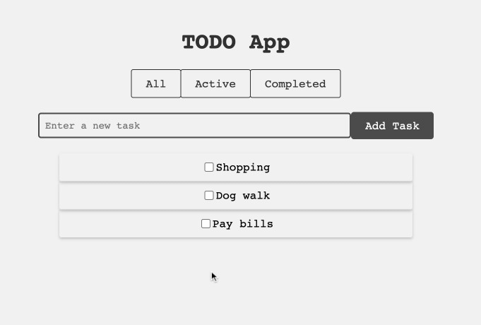

<h1 align="center">TODOapp</h1>

  <strong>A simple todo list application built with JavaScript.</strong>

  <a href="#features">Features</a> •
  <a href="#installation">Installation</a> •
  <a href="#usage">Usage</a> 

---

  

## Features

- Add tasks to the list
- Mark tasks as completed
- Delete tasks from the list
- Filter tasks by status (all, active, completed)

## Installation

1. Clone the repository:
git clone https://github.com/bfriscic/TODOapp.git

2. Navigate to the project directory:
cd TODOapp

3. Open `index.html` in your preferred web browser.

## Usage

1. Enter a task in the input field.
2. Press Enter or click the Add button to add the task to the list.
3. Click the checkbox to mark a task as completed.
4. Click a task to toggle its completion status.
5. Right-click a task to delete it from the list.
6. Use the filter buttons at the top to show all tasks, active tasks, or completed tasks.
